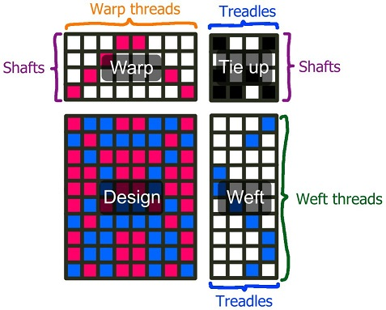
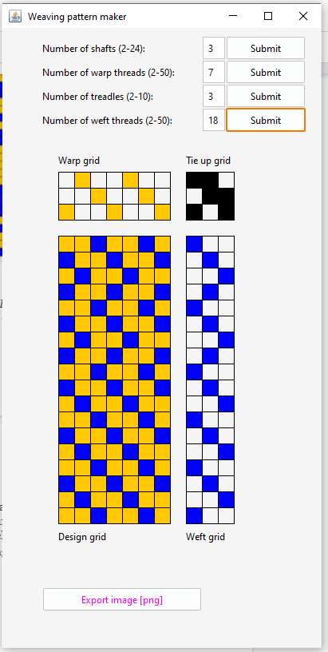
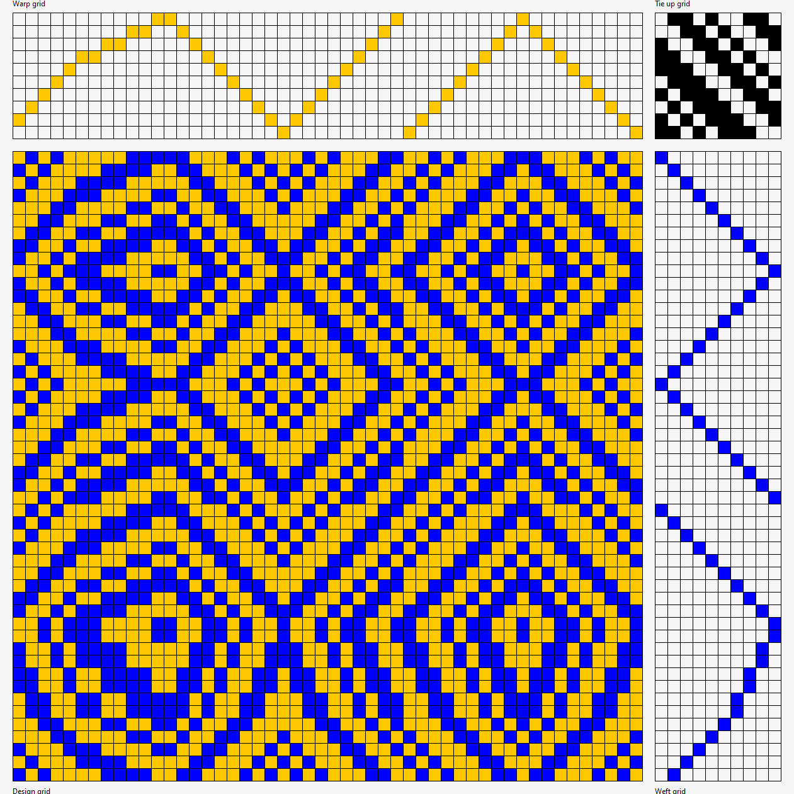
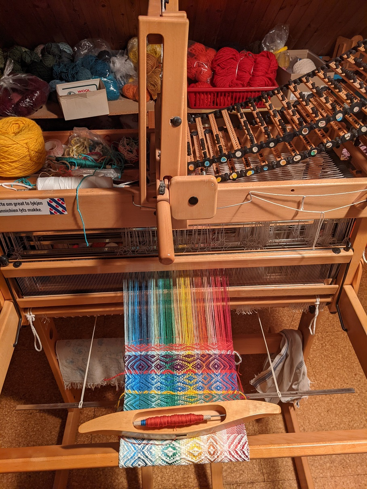

# Weaving Pattern Editor
This is a simple software to create weaving patterns for looms.

This is a practice program I wrote as part of my Java OCA course.

This program is written in Java and uses *Swing* for the GUI. The user can choose the number of shafts, warp threads, treadles and weft threads, select the positions of the warp threads, tie up buttons and weft threads to create a pattern, and export it as png (see images below).

## Explanation

The **design** grid represents the pattern of the fabric that will appear after weaving it when the user uses the specified number of **shafts** and **treadles** and sets up the loom according to the draft plan. The color of a specific cell of the design grid is either the color of the corresponding **warp-** or **weft thread**. To know which one, you have to look in the **tie up** cell that has the y-coordinate from the **warp** grid and the x-coordinate from the **weft** grid. Depending on whether that tie up cell is marked or not, the warp or weft color is choosen. 

## Screenshot

## Exported Draft Plan

## Magic Dobby Loom in Action

